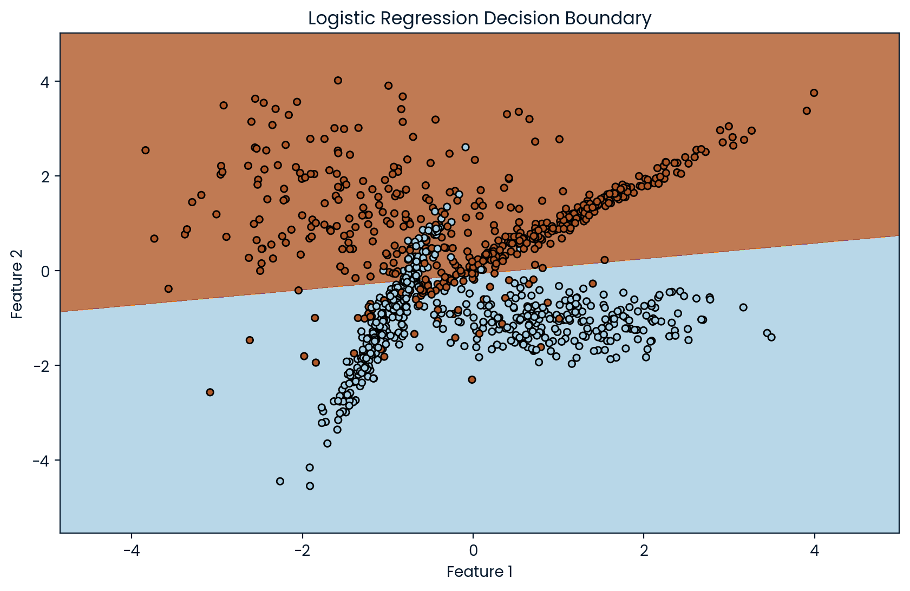

# Machine Learning Top 10 Algorithms

Each algorithm is accompanied by a detailed explanation and a corresponding Python script to help you understand and apply these powerful tools in your data science projects.

## Algorithms

| Algorithm                           | Python Script                                                                      | Visualizations                                               |
| ----------------------------------- | ---------------------------------------------------------------------------------- | ------------------------------------------------------------ |
| Linear Regression                   | [linear_regression.py](./linear_regression.py)                                     |                    |
| Logistic Regression                 | [logistic_regression.py](./logistic_regression.py)                                 |                  |
| Decision Trees                      | [decision_trees.py](./decision_trees.py)                                           |                       |
| Support Vector Machine (SVM)        | [svm.py](./svm.py)                                                                 |                                  |
| Naive Bayes                         | [naive_bayes.py](./naive_bayes.py)                                                 |                          |
| k-Nearest Neighbors (kNN)           | [knn.py](./knn.py)                                                                 |                                  |
| K-Means Clustering                  | [kmeans.py](./kmeans.py)                                                           |                               |
| Random Forest                       | [random_forest.py](./random_forest.py)                                             |                        |
| Dimensionality Reduction Algorithms | [dimensionality_reduction_algorithms.py](./dimensionality_reduction_algorithms.py) |  |
| Gradient Boosting Algorithms        | [gradient_boosting_algorithms.py](./gradient_boosting_algorithms.py)               |         |
